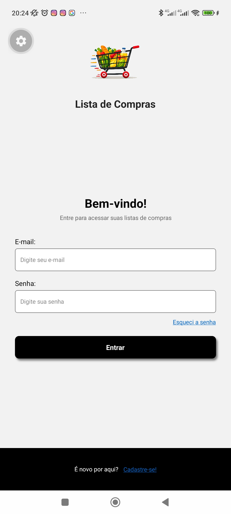
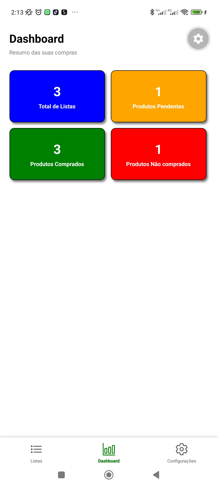

Aluno: Cássio Lucio
Descrição do APP: Projeto TODO List mas num formato para Lista de compras para mercados.
Prints:

Por enquanto para testar o APP basta colocar um email que valide a entrada e qualquer digito na senha
exemplo: email:teste@teste.teste senha:1